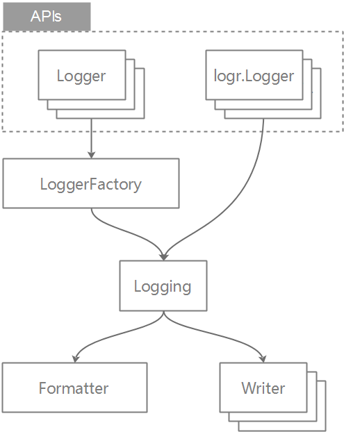

# xlog

[](https://goreportcard.com/report/github.com/xfali/xlog)
[](https://pkg.go.dev/github.com/xfali/xlog)
[](https://ci.appveyor.com/project/xfali/xlog)

xlog是一个go日志框架，提供简单易用的日志[API](logger.go)。

xlog同时实现了[logr API (v0.2.0)](https://github.com/go-logr/logr) (xlogr)

xlog各层可以自行实现接口进行替换，根据实际业务进行配置:




## 安装
```
go get github.com/xfali/xlog
```

## 使用

### 1. 快速入门
```
logger := xlog.GetLogger()
logger.Infof("hello %s\n", "world")
logger.Panic("panic !")

// 或使用默认函数
xlog.Infof("hello %s\n", "world")
xlog.Panic("panic !")
```

### 2. 配置日志级别
xlog共支持6个日志级别：
|  类型   | 说明  |
|  :----  | :----  |
| DEBUG  | 最低级别，默认不输出 |
| INFO  |  默认的日志级别 |
| WARN  |  警告级别  |
| ERROR  | 错误级别 |
| PANIC  | Panic级别，会触发panic,参数类型为xlog.KeyValues（内置logging可配置panic函数）|
| FATAL  | 致命错误，会触发程序退出（内置logging可配置退出函数） |
```
xlog.SetSeverityLevel(xlog.WARN)
```

### 3. 配置输出Writer
xlog默认输出到os.Stdout，可以通过下面方法配置输出的writer
```
// 所有日志级别统一配置为参数的输出writer
xlog.SetOutput(w)

// 或者按日志级别配置输出writer
xlog.SetOutputBySeverity(xlog.WARN, w)
```

### 4. 配置日志格式Formatter
内置支持的Formatter有：
* xlog.TextFormatter
* xlog.JsonFormatter
```
xlog.SetFormatter(f)
```

### 5. 使用logr API
```
logr := xlogr.NewLogr()
logr.Info("this is a test", "time", time.Now(), "float", 3.14)
```

## 内置Writer
xlog内置的输出writer有：
* AsyncBufferLogWriter: 线程安全的异步带缓存的writer
* AsyncLogWriter: 线程安全的异步无缓存的writer
* RotateFileWriter: 滚动记录日志的writer

(一般RotateFileWriter结合AsyncBufferLogWriter使用)

也可以使用第三方输出writer，如：

[file-rotatelogs](https://github.com/lestrrat-go/file-rotatelogs)
### 
使用内置输出writer配置如下(详细配置请参考参数的注释说明)：
```
w := writer.NewRotateFileWriter(&writer.RotateFile{
		Path:            "./test.log",
		RotateFrequency: writer.RotateEveryDay,
		RotateFunc:      writer.ZipLogsAsync,
	}, writer.Config{
	
	})
xlog.SetOutput(w)
```

